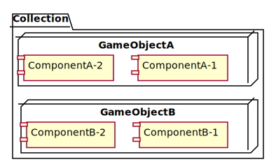

# Welcome to Defold

This project was created from the "empty" project template.

The settings in ["game.project"](defold://open?path=/game.project) are all the default. A bootstrap empty ["main.collection"](defold://open?path=/main/main.collection) is included.

Check out [the documentation pages](https://defold.com/learn) for examples, tutorials, manuals and API docs.

If you run into trouble, help is available in [our forum](https://forum.defold.com).

Happy Defolding!

---
# DEFOLDでシューティングゲームを作る
ここからは作業記録です。

---
## プロジェクトを作成する
- DEFOLDアプリ起動
- NEW PROJECT
- EMPTY PROJECT
- 下部の[Title]に任意の名前指定
- 下部の[Location]に任意のディレクトリ指定
- CREATE

これでプロジェクトができました。  
プロジェクトができたタイミングで一旦コミットするのが私の流儀。  
ちゃんとデフォルトで.gitignoreが入ってる。  
ありがたや〜。

### ファイルの中身を眺めてみる
```
game.project
input/game.input_binding
main/main.collection
README.md
.gitignore
```


プロジェクトの作成で生成されたファイルは全てテキストファイルでした。  
なので中身をさらっと眺めてみます。

#### game.project
iniファイルっぽい形式でプロジェクトの設定が書いてある。

```
[bootstrap]
main_collection = /main/main.collectionc

[script]
shared_state = 1

[display]
width = 960
height = 640

[android]
input_method = HiddenInputField

[project]
title = shootingsample
```

#### input/game.input_binding
フォーマットは不明。  
入力に関することが書いてある。

```
mouse_trigger {
  input: MOUSE_BUTTON_1
  action: "touch"
}
```

### main/main.collection
inputのファイルと同じ形式なのかな？  
このファイルがメイン画面に相当するみたい。

```
name: "main"
scale_along_z: 0
```

## 画像を用意する
### 画像をassetsディレクトリに置く
ゲームなので画像がないと始まりません。
enchant.jsの画像を使わせていただきます。
- car.png
- bomb.png

プロジェクト直下に`assets`ディレクトリを作成し、これらのファイルをおきます。  

### atlasファイルを作る
DEFOLDで画像を使う場合は、画像を直接読み込まずにatlasというファイルを経由します。
- assetsディレクトリで右クリック
- Atlasを選択
- `chara`という名前で保存

参考: atlas https://defold.com/manuals/atlas/

### atrasに画像を追加する
- chara.atrasを開き、IDE右側のoutlineの`Atras`を右クリック
- `Add Images`を選択
- 画像を2つ選択する
  - /assets/bomb.png
  - /assets/car.png
- ctrl + Sで保存する

## DEFOLTの設計
画像のセットアップが終わったのでここからゲーム製作に入っていきますが、その前にDEFOLDの基本的な構成を知るべきです。

公式サイトによるとDEFOLDの設計を学ぶのにはちょっと時間がかかるとのこと。ゆっくりいきましょう。
[The building blocks of Defold](https://defold.com/manuals/building-blocks/)
とりあえず今は基本構成だけおさえておきます。
以下の引用は、公式サイトをgoogle翻訳したものです。

### Collection
> コレクションは、ゲームの構造化に使用されるファイルです。コレクションでは、ゲームオブジェクトと他のコレクションの階層を構築します。それらは通常、ゲームレベル、敵のグループ、または複数のゲームオブジェクトから構築されたキャラクターを構築するために使用されます。

プロジェクト作成直後にある`main.collection`はコレ。CollectionにはGame objectを追加できる。 

### Game object
> ゲームオブジェクトは、ID、位置、回転、スケールを持つコンテナです。コンポーネントを含めるために使用されます。これらは通常、プレイヤーキャラクター、弾丸、ゲームのルールシステム、またはレベルローダー/アンローダーを作成するために使用されます。

これが中心になる概念。Game objectにはコンポーネントを追加できる

### Component
> コンポーネントは、ゲーム内に視覚的、可聴的、および/または論理的表現を与えるためにゲームオブジェクトに配置されるエンティティです。通常、キャラクタースプライトの作成、スクリプトファイルの作成、サウンドエフェクトの追加、パーティクルエフェクトの追加に使用されます。
Luaのコードもコンポーネントの１つ。

絵にするとこんな感じ



## 自機を作る
自機を作ります。
IDEでメイン画面に相当するmain.collectionを開くと画面編集っぽい画面が表示されます。

ここに自機に相当するGameObjectを作成します。
### 自機のGameObjectを作る
- 画面右上のoutlineにあるCollectionで右クリック
- [Add Game Object]を選択
- GameObjectが生成されたらpropertiesでIdを`player`に変更

### 自機にスプライトを追加する
自機のGameObjectにスプライトComponentを追加します。
- 画面右上のoutlineにあるplayerを右クリック
- [Add Component]を選択
- [Sprite]を選択
- PropertiesのImageにある[...]をクリック
- `/assets/chara.atras`を選択
- PropertiesのDefault Animationで`car`を選択

これで画面に車の画像が表示されたか、画面が真っ赤になれば成功。  
画面が真っ赤になるのは車にめっちゃズームしてるから。その場合はマウスのスクロールを回してズームアウトしましょう。

この状態でBuild(Ctrl + B)するとゲームが実行できます。画面の右下に車がちょっとだけ表示されれば成功です。

## なぜ車が画面右下にちょっとだけ表示されるのか？
Build後に表示されるウィンドウで車が画面中央に表示されると期待した方も多いと思いますが、実際は画面の端っこにちょっとだけ表示されました。理由はスプライトの座表示です。
